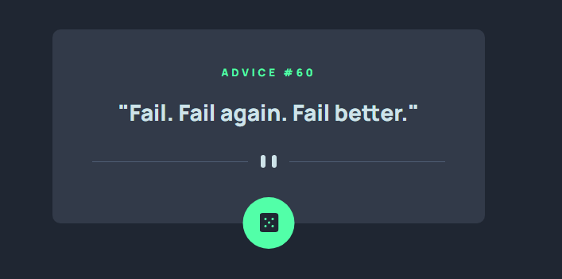

# Frontend Mentor - Advice generator app solution

This is a solution to the [Advice generator app challenge on Frontend Mentor](https://www.frontendmentor.io/challenges/advice-generator-app-QdUG-13db). Frontend Mentor challenges help you improve your coding skills by building realistic projects.

## Table of contents

- [Overview](#overview)
  - [The challenge](#the-challenge)
  - [Screenshot](#screenshot)
  - [Links](#links)
- [My process](#my-process)
  - [Built with](#built-with)
  - [Continued development](#continued-development)
- [Author](#author)

## Overview

### The challenge

Users should be able to:

-View the optimal layout for the app depending on their device's screen size
-See hover states for all interactive elements on the page
-Generate a new piece of advice by clicking the dice icon

### Screenshot

### Links

- Solution URL: [Solution URL](https://www.frontendmentor.io/solutions/advice-generator-app-with-html-css-and-js-BkO4RydB9)
- Live Site URL: [Live site URL](https://sanketcharanpahadi.github.io/advice-generator-app/)

## My process

### Built with

- Semantic HTML5 markup
- CSS custom properties
- Flexbox
- Mobile-first workflow

### Continued development

I want to continue learning about using APIs

## Author

<!-- - Website - [Add your name here](https://www.your-site.com) -->

- Frontend Mentor - [@sanketcharanpahadi](https://www.frontendmentor.io/profile/sanketcharanpahadi)
- Twitter - [@SanketK86551440](https://www.twitter.com/SanketK86551440)
